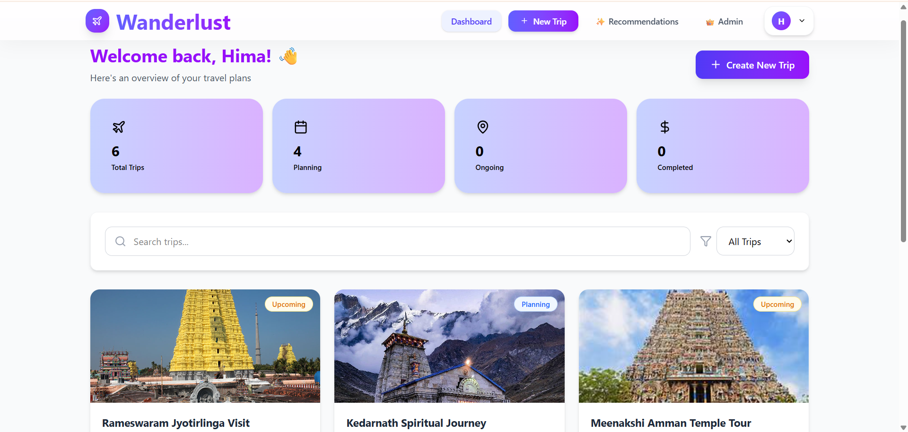
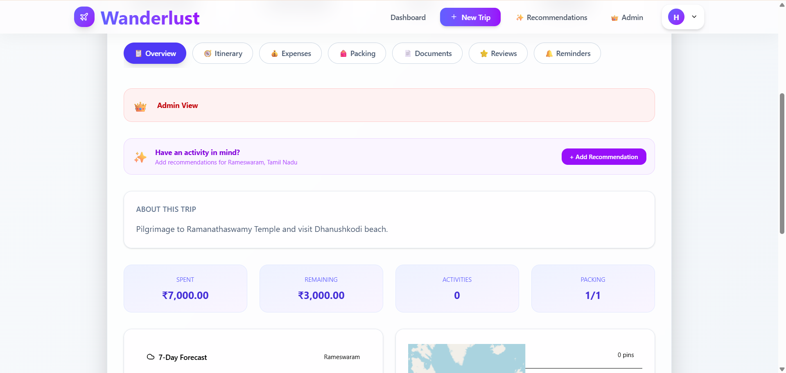
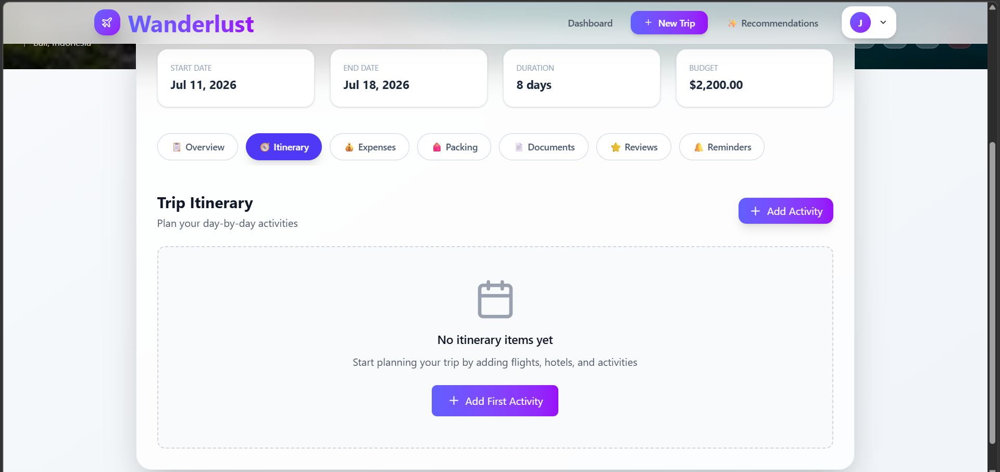
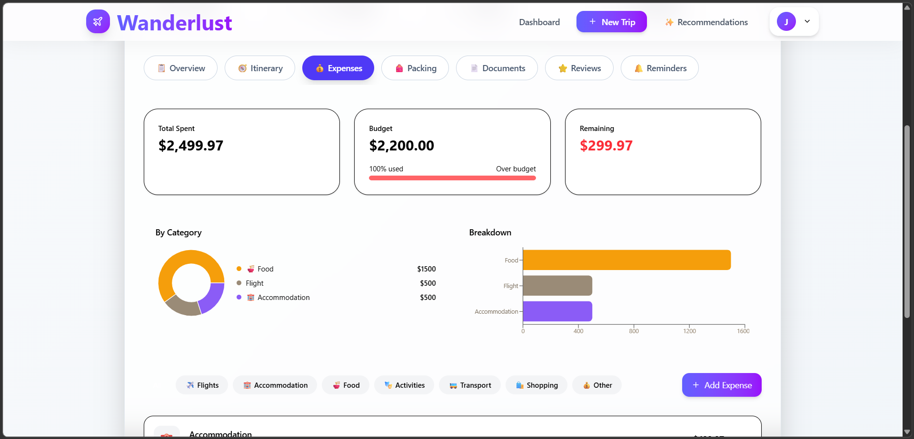
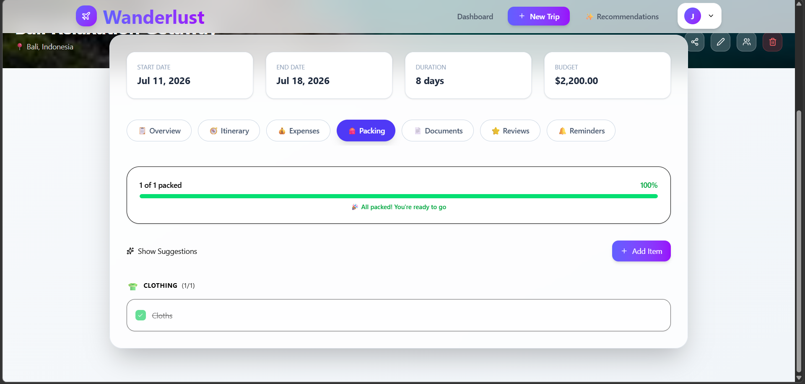
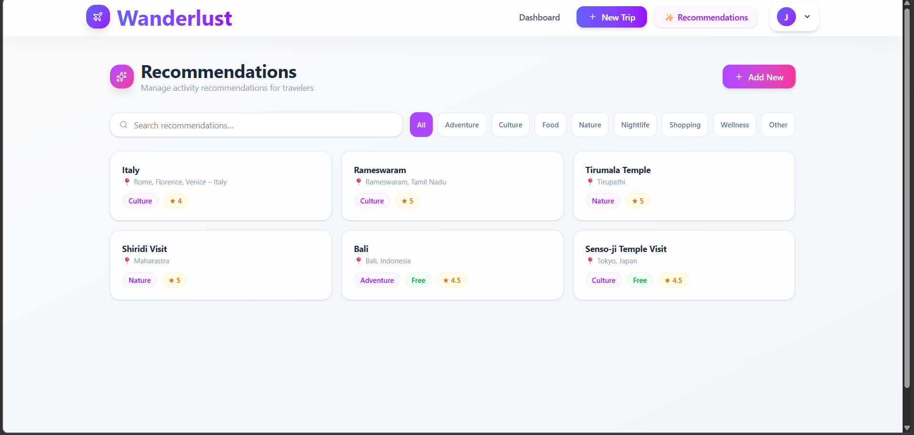
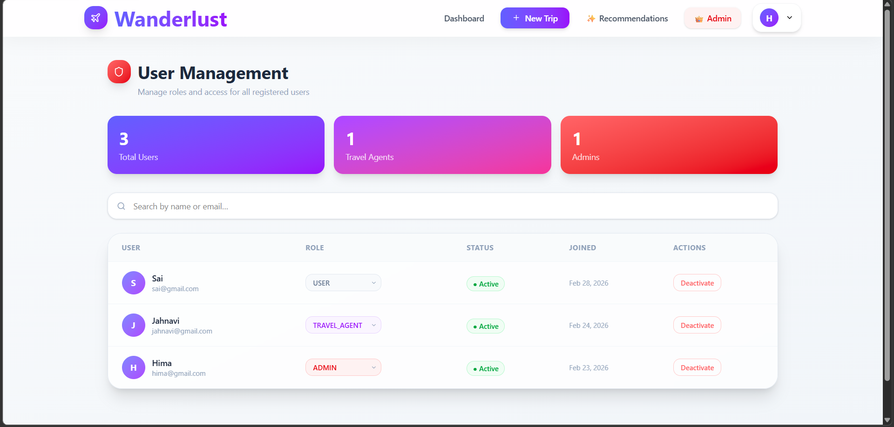
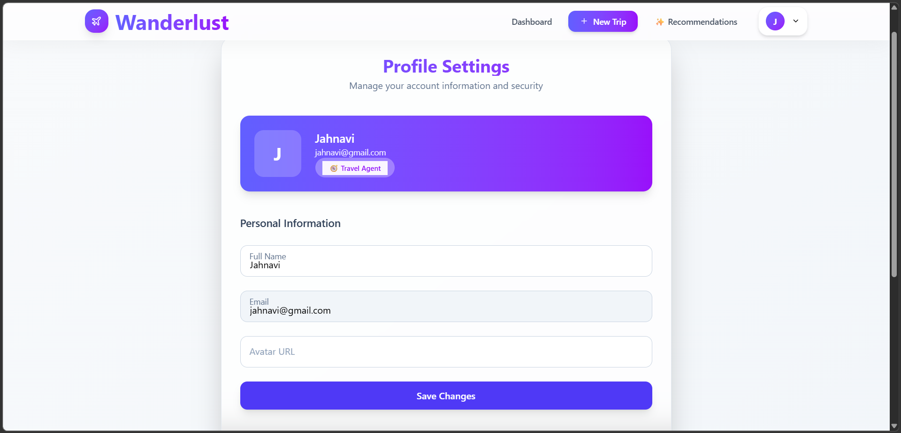

# 🌍 **Wanderlust — Travel Itinerary Planner**

 A modern, beautiful travel itinerary planner built with React. Plan trips, track expenses, manage packing lists, store documents, and discover activity recommendations — all in one place.

---

## 📝 Project Description

Wanderlust is a full-stack travel planning web application that helps travelers organize every aspect of their trips. From day-by-day itinerary planning to budget tracking and packing lists, Wanderlust provides a clean and intuitive interface for managing all travel needs.

The frontend is built with React 18 and Vite, featuring a warm, refined design system with smooth animations and full mobile responsiveness. It connects to a Node.js + Supabase backend via a RESTful API and implements role-based access control (RBAC) for three user roles: `USER`, `TRAVEL_AGENT`, and `ADMIN`.

---

## ✨ Features

### 👤 Authentication
- User registration and login with JWT authentication
- Protected routes — unauthenticated users are redirected to login
- Persistent login session with token stored in localStorage

### 🏠 Landing Page
- Hero carousel with auto-rotating travel destination images
- Feature highlights and popular destinations grid
- Fully responsive with smooth animations

### 📊 Dashboard
- Overview of all trips with status filters (Planning, Upcoming, Ongoing, Completed)
- Trip stats cards (Total Trips, Upcoming, Completed, Total Budget)
- Search trips by title or destination
- Staggered card animations on load

### ✈️ Trip Management
- Create trips with title, destination, dates, budget, currency, status, and cover image
- Edit and delete trips
- Trip detail page with hero image and quick info bar

### 🧭 Itinerary Planning
- Day-by-day timeline view
- Activity types: Flight, Accommodation, Activity, Restaurant, Transport
- Status tracking: Planned, Confirmed, Completed, Cancelled
- Add, edit, and delete itinerary items

### 💰 Expense Tracking
- Budget progress bar with percentage used
- Category breakdown with pie and bar charts (Recharts)
- Over-budget warnings
- Filter expenses by category

### 🎒 Packing List
- Category-grouped packing items
- Toggle packed/unpacked with progress bar
- Smart packing suggestions panel
- Quantity support per item

### 📄 Documents
- Store travel documents (Passport, Visa, Tickets, Hotel, Insurance, ID)
- Expiry date tracking with colour-coded warnings (expired / expiring soon)

### ⭐ Reviews
- Star rating system (1–5 stars)
- Average rating display with distribution bars
- Category tags (Attraction, Restaurant, Hotel, etc.)
- Moderator approve button for ADMIN / TRAVEL_AGENT roles

### 🔔 Reminders
- Date/time based reminders with type picker
- Sorted chronologically
- Past reminders visually grayed out

### 👥 Trip Sharing
- Share trips via email with view/edit permission levels
- Copy shareable link to clipboard
- Manage and remove existing shares

### ✨ Activity Recommendations
- All users can add recommendations to their own trips
- Travel Agents and Admins can manage global recommendations
- Category filter pills, star ratings, price range badges
- Auto-refresh panel after adding a new recommendation

### 👤 Profile
- Update name and avatar URL
- Change password with validation
- Role badge display (USER / TRAVEL_AGENT / ADMIN)

### 🔐 Role-Based Access Control (RBAC)
- **USER** — full access to their own trips and all features
- **TRAVEL_AGENT** — everything USER can do + global recommendation management + review moderation
- **ADMIN** — everything TRAVEL_AGENT can do + user management (roles, status)
- Role-restricted nav links and UI elements using `RoleGuard` component

---

## 🛠 Tech Stack Used

| Category | Technology |
|---|---|
| Framework | React 18 |
| Build Tool | Vite |
| Routing | React Router v6 |
| Styling | Tailwind CSS |
| HTTP Client | Axios |
| Charts | Recharts |
| Maps | Leaflet + React-Leaflet |
| Icons | Lucide React |
| Date Handling | date-fns |
| State Management | React Context API (AuthContext) |
| Auth | JWT (stored in localStorage) |
| Fonts | Cormorant Garamond + DM Sans (Google Fonts) |

---

## ⚙️ Installation Steps

### Prerequisites
- Node.js v18 or higher
- npm v9 or higher
- Backend API running (see backend repository)

### 1. Clone the repository

```bash
git clone https://github.com/your-username/wanderlust-frontend.git
cd wanderlust-frontend
```

### 2. Install dependencies

```bash
npm install
```

### 3. Set up environment variables

Create a `.env` file in the root directory:

```env
VITE_API_URL=http://localhost:4000/api
```

> Replace with your deployed backend URL in production.

### 4. Start the development server

```bash
npm run dev
```

### 5. Build for production

```bash
npm run build
```

---

## 🚀 Deployment Link

> **Live App:** https://travel-itinerary-planner-fe-fepy.vercel.app

**Recommended deployment platforms:**

| Platform | Free Tier | Notes |
|----------|-----------|-------|
| [Vercel](https://vercel.com) | ✅ | Best for React + Vite |
| [Netlify](https://netlify.com) | ✅ | Easy drag and drop deploy |

**Environment variable to set in production:**

```env
VITE_API_URL=https://your-backend-url.com/api
```

---

## 🔗 Backend API Link

> **Backend Repository:** https://github.com/HimajahnaviKanagala/Travel-Itinerary-Planner-BE

> **Live API Base URL:** https://travel-itinerary-planner-be-1.onrender.com
---

## 🔑 Login Credentials

Use the following test accounts to explore the app:

### 👤 Regular User
```
Email:    user@wanderlust.com
Password: password123
```
Access: Full trip management, itinerary, expenses, packing, documents, reviews, reminders, recommendations.

### 🧭 Travel Agent
```
Email:    agent@wanderlust.com
Password: password123
```
Access: Everything USER can do + global recommendations management + review moderation.

### 👑 Admin
```
Email:    admin@wanderlust.com
Password: password123
```
Access: Everything TRAVEL_AGENT can do + user management panel (change roles, activate/deactivate users).

---

## 📸 Screenshots

### Landing Page


### Dashboard


### Trip Details — Overview Tab


### Itinerary Tab


### Expenses Tab


### Packing List Tab


### Reviews Tab


### Activity Recommendations Panel


### Admin — User Management


### Profile Page


---

## 🎥 Video Walkthrough Link

> **Video Walkthrough:** https://drive.google.com/file/d/1ggK9OrRNp7-nttHi7GTKErHifIFxuBfh/view?usp=sharing

---

## 📁 Project Structure

```
wanderlust-frontend/
├── public/
├── src/
│   ├── components/
│   │   ├── tabs/
│   │   │   ├── ItineraryTab.jsx
│   │   │   ├── ExpensesTab.jsx
│   │   │   ├── PackingTab.jsx
│   │   │   ├── DocumentsTab.jsx
│   │   │   ├── ReviewsTab.jsx
│   │   │   └── RemindersTab.jsx
│   │   ├── widgets/
│   │   │   ├── WeatherWidget.jsx
│   │   │   ├── MapWidget.jsx
│   │   │   └── ExpenseChart.jsx
│   │   ├── modals/
│   │   │   └── ShareTripModal.jsx
│   │   ├── recommendations/
│   │   │   └── RecommendationsPanel.jsx
│   │   ├── Navbar.jsx
│   │   ├── PrivateRoute.jsx
│   │   ├── RoleGuard.jsx
│   │   ├── RoleBadge.jsx
│   │   ├── Modal.jsx
│   │   ├── ConfirmDialog.jsx
│   │   ├── LoadingSpinner.jsx
│   │   ├── StatCard.jsx
│   │   ├── TripCard.jsx
│   │   └── ToastProvider.jsx
│   ├── context/
│   │   └── AuthContext.jsx
│   ├── hooks/
│   │   └── useRole.js
│   ├── pages/
│   │   ├── Landing.jsx
│   │   ├── Login.jsx
│   │   ├── Register.jsx
│   │   ├── Dashboard.jsx
│   │   ├── CreateTrip.jsx
│   │   ├── TripDetails.jsx
│   │   ├── Profile.jsx
│   │   ├── AdminUsers.jsx
│   │   └── ManageRecommendations.jsx
│   ├── services/
│   │   └── api.js
│   ├── utils/
│   │   ├── dateHelpers.js
│   │   ├── currencyHelpers.js
│   │   └── roleHelpers.js
│   ├── App.jsx
│   ├── main.jsx
│   └── index.css
├── index.html
├── vite.config.js
├── .env
└── package.json
```

---

